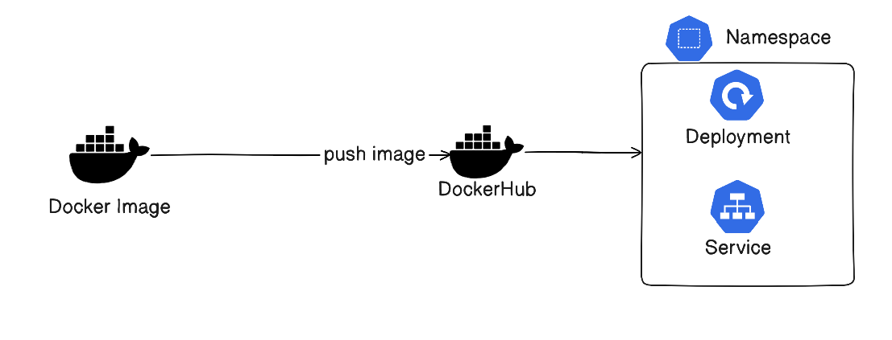
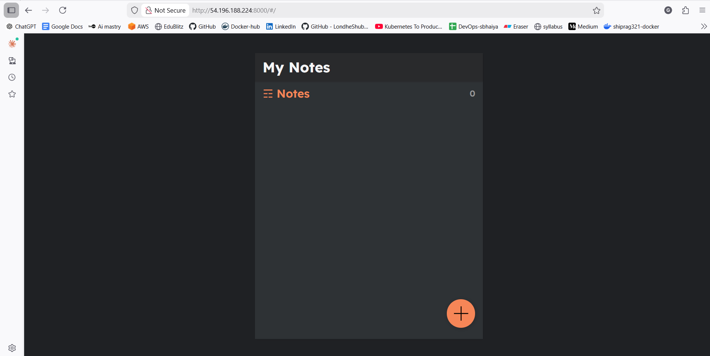

# Django Notes App Deployment on Kubernetes

## Project Description

This project demonstrates the end-to-end deployment of a **containerized Django Notes application** on a Kubernetes cluster.

It covers the complete DevOps lifecycle:

* Application containerization using Docker
* Image management with DockerHub
* Kubernetes resource creation
* Application exposure using Service
* Real-world troubleshooting and debugging
* 
The goal of this project is to simulate a **production-like Kubernetes deployment workflow** for a stateful web application.

---

## Architecture

```
Developer → Docker → DockerHub → Kubernetes Cluster → Deployment → Pods → Service → Browser
```



### Flow Explanation

1. Django application is containerized using Docker.
2. Docker image is pushed to DockerHub.
3. Kubernetes pulls the image and creates Pods using a Deployment.
4. Service exposes the application externally.
5. Users access the app via ClusterIP.

---

## Tech Stack

### Application

* Python 3.9
* Django
* MySQL client

### DevOps & Cloud

* Docker
* Kubernetes
* DockerHub
* Linux (Ubuntu)

---

## Step-by-Step Implementation

### 1️⃣ Containerization of Django App

#### Dockerfile

* Used official Python 3.9 image
* Installed system dependencies
* Installed Python dependencies
* Copied application code
* Exposed port 8000

Docker image build:

```bash
docker build -t <dockerhub-username>/notes-app .
```

Push to DockerHub:

```bash
docker push <dockerhub-username>/notes-app
```

---

### 2️⃣ Kubernetes Setup

#### Create Namespace

```bash
kubectl apply -f namespace.yml
```

Namespace provides logical isolation for project resources.

---

### 3️⃣ Deployment Creation

Deployment ensures:

* Pod auto-healing
* Scaling
* Rolling updates

```bash
kubectl apply -f deployment.yml
```

---

### 4️⃣ Service Exposure

ClusterIP Service exposes the Django application outside the cluster.

```bash
kubectl apply -f service.yml
```

---

## Verification Commands

### Check all resources

```bash
kubectl get all -n notes-app-ns
```

### Describe pod

```bash
kubectl describe pod <pod-name> -n notes-app-ns
```

### Check logs

```bash
kubectl logs <pod-name> -n notes-app-ns
```

---

### Expose application

```bash
 sudo -E kubectl port-forward service/notes-app-service -n notes-app-ns 8000:8000 --address=0.0.0.0
```

## Access the Application

Open in browser:

```
http://<public-IP>:8000
```



---

# Real-World Troubleshooting & Debugging

This project includes multiple production-like failure scenarios and their resolution.

---

## 🔴 Issue 1: CrashLoopBackOff

### Cause

Container was exiting immediately because:

* No runtime command to start Django server

### Fix

Added application startup command in Dockerfile:

```dockerfile
CMD ["python", "manage.py", "runserver", "0.0.0.0:8000"]
```

---

## 🔴 Issue 2: Empty Logs

### Cause

Main process was not running inside the container.

### Fix

Ensured a long-running Django process.

---

## 🔴 Issue 4: Node Creation Failure (Cluster Level)

### Cause

Worker nodes failed to join the cluster due to IAM / networking / bootstrap issues.

### Fix

* Verified node IAM role
* Checked security group rules
* Ensured proper cluster endpoint access

---

# Scaling the Application

```bash
kubectl scale deployment note-app-deployment --replicas=3 -n notes-app-ns
```

This creates multiple pods for high availability.

---

# Kubernetes Concepts Used

* Namespace
* Deployment
* ReplicaSet
* Pod
* Service (ClusterIP)
* Cluster networking
* Image pull from DockerHub

---

# Key Learning Outcomes

- End-to-end Kubernetes deployment
- Docker to Kubernetes workflow
- Production-style debugging
- Pod lifecycle understanding
- Service exposure & networking
- Application scaling

---

# Future Enhancements

* Ingress Controller with domain
* Persistent Volume for database
* ConfigMap & Secrets
* CI/CD pipeline (GitHub Actions / Jenkins)
* Helm chart packaging
* AWS EKS production deployment
* Horizontal Pod Autoscaler (HPA)
